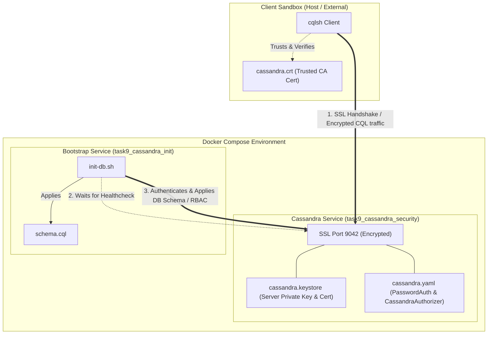

# Enterprise Apache Cassandra Security (RBAC + Client-to-Node SSL Encryption)

This repository provides a production-grade, containerized Apache Cassandra sandbox demonstrating advanced security features. It features automatic certificate generation, secure TLS client-to-node encryption, robust Role-Based Access Control (RBAC), and automated schema/role provisioning on startup.

---

## Architecture Overview

The system runs entirely within a Docker Compose environment. When started, the Cassandra node is configured with password-based authentication and database-level authorization. The client-to-node communication is secured using one-way SSL/TLS encryption.



---

## Key Enhancements in This Repository

1. **Automated SSL/TLS Bootstrap**: Added Unix Bash (`scripts/generate-certs.sh`) and Windows PowerShell (`scripts/generate-certs.ps1`) scripts to easily generate keystores and export public certificates with a single click.
2. **Clean Container Lifecycles**: Removed brittle inline `sed` operations from the `docker-compose.yml` file. Configuration changes are now executed cleanly via a custom entrypoint script (`scripts/entrypoint.sh`), preserving the official image initialization.
3. **Health-Driven Architecture**: Added container-native healthchecks using Cassandra's JMX-based `nodetool status` commands to guarantee container readiness before dependent actions run.
4. **Auto-Provisioned Schema & RBAC**: Integrated an automated database initializer service (`cassandra-init`) that waits for the database cluster to start, connects securely via SSL, and automatically provisions keyspaces, tables, initial data, and RBAC roles.
5. **Secured Host Permissions**: Keystore file permissions are automatically tightened inside the container to prevent security warnings and runtime access problems.

---

## Repository Structure

```text
.
├── certs/
│   ├── cassandra.crt              # Exported server certificate (for cqlsh trust)
│   └── cassandra.keystore         # Generated Java keystore (excluded from Git)
├── scripts/
│   ├── entrypoint.sh              # Custom Cassandra entrypoint script (manages YAML config)
│   ├── generate-certs.sh          # Certificate & keystore generator for Linux/macOS
│   ├── generate-certs.ps1         # Certificate & keystore generator for Windows
│   ├── init-db.sh                 # Database bootstrapper (waits for healthcheck and runs CQL)
│   └── schema.cql                 # CQL script defining keyspaces, tables, and roles
├── docker-compose.yml             # Orchestration file for Cassandra and the init bootstrapper
└── README.md                      # Documentation
```

---

## Getting Started

### Prerequisites

Before running the project, make sure you have the following installed on your host system:
* [Docker Desktop](https://www.docker.com/products/docker-desktop/) (v20.10+ / Compose v2.0+)
* Java JDK (OpenJDK 17 or higher) to provide `keytool` on your host path.

---

### Step 1: Generate the SSL Keystore & Certificate

Run the certificate generator appropriate for your operating system. This generates a secure keystore (`certs/cassandra.keystore`) and exports the public certificate (`certs/cassandra.crt`) used by the client for validation.

> [!NOTE]
> By default, the scripts configure the certificate's Common Name (CN) to `localhost`. If deploying to a remote server or VM (like an Azure VM), pass the public IP or domain name as an argument.

#### On Linux / macOS (Bash):
```bash
# Allow execution permissions
chmod +x scripts/generate-certs.sh

# Generate for localhost
./scripts/generate-certs.sh

# OR generate for a specific public IP (e.g. Azure VM)
./scripts/generate-certs.sh 40.75.89.78
```

#### On Windows (PowerShell):
```powershell
# Run the generator for localhost
.\scripts\generate-certs.ps1

# OR generate for a specific public IP
.\scripts\generate-certs.ps1 -HostIP "40.75.89.78"
```

---

### Step 2: Start the Services

Spin up the cluster using Docker Compose:

```bash
docker compose up -d --build
```

This launches:
1. `task9_cassandra_security`: The main Cassandra node. It applies the custom entrypoint, sets up SSL, enables password authentication/authorization, and starts.
2. `task9_cassandra_init`: A temporary service that monitors the health of the Cassandra service. Once Cassandra is healthy, it runs the schema script using SSL and immediately terminates.

#### Verify Startup Progress
You can watch the automated setup process in real-time by checking the logs:

```bash
# Watch the Cassandra database logs
docker logs -f task9_cassandra_security

# Watch the automatic initialization logs
docker logs -f task9_cassandra_init
```

Once the database is initialized, you should see the following lines in the `task9_cassandra_init` logs:
```text
==========================================================
 Starting Cassandra DB & RBAC Schema Initializer
==========================================================
[*] Waiting for Cassandra CQL service to accept SSL connections...
[+] Cassandra is online and accepting SSL connections!
[*] Applying schema and roles configuration from /scripts/schema.cql...
[+] Schema and Roles applied successfully!
==========================================================
 Database Initialization Completed Successfully
==========================================================
```

---

## Security Configuration Details

### Pre-Configured RBAC Roles

The system automatically initializes two distinct roles with different permission scopes:

| Role Name | Password | Keyspace Permissions | Description |
| :--- | :--- | :--- | :--- |
| `readonly_user` | `Read@123` | `SELECT` on `task9_demo` | Can query tables but cannot modify data or schemas. |
| `writer_user` | `Write@123` | `SELECT`, `MODIFY` on `task9_demo` | Can query and perform DML operations (INSERT, UPDATE, DELETE). |
| `cassandra` (Default Superuser) | `cassandra` | All | Administrative access to the cluster. |

> [!WARNING]
> In a production environment, you should immediately change the default superuser credentials or disable the default `cassandra` role after bootstrap.

---

## Verification & Manual Testing

### 1. Connecting as Administrator (Superuser)

To connect securely using SSL with the default administrative superuser:

```bash
docker exec -it \
  -e SSL_CERTFILE=/certs/cassandra.crt \
  task9_cassandra_security \
  cqlsh --ssl -u cassandra -p cassandra
```

Verify that the schema and initial data were applied successfully:

```sql
USE task9_demo;
SELECT * FROM employees;
```

---

### 2. Testing the Read-Only Access (`readonly_user`)

Connect with the read-only credentials:

```bash
docker exec -it \
  -e SSL_CERTFILE=/certs/cassandra.crt \
  task9_cassandra_security \
  cqlsh --ssl -u readonly_user -p 'Read@123'
```

#### Read Permission Check (Should Succeed)
```sql
USE task9_demo;
SELECT * FROM employees;
```

#### Write Permission Check (Should Fail)
Attempt to insert a new record:
```sql
INSERT INTO employees (id, name, department, salary)
VALUES (2, 'Malicious User', 'HR', 99999);
```
> [!IMPORTANT]
> **Expected Output:**
> `Unauthorized: Error from server: code=2100 [Unauthorized] message="User readonly_user has no MODIFY permission on <keyspace task9_demo> or any of its tables"`

Exit the terminal:
```sql
EXIT;
```

---

### 3. Testing the Writer Access (`writer_user`)

Connect with the writer credentials:

```bash
docker exec -it \
  -e SSL_CERTFILE=/certs/cassandra.crt \
  task9_cassandra_security \
  cqlsh --ssl -u writer_user -p 'Write@123'
```

#### Write Permission Check (Should Succeed)
```sql
USE task9_demo;
INSERT INTO employees (id, name, department, salary)
VALUES (2, 'Alice Smith', 'Engineering', 85000);
```

#### Verify the Data Insertion
```sql
SELECT * FROM employees;
```
You should now see both `Shubh` and `Alice Smith` in the query output!

Exit the terminal:
```sql
EXIT;
```

---

## Troubleshooting

### 1. `keytool: command not found` on Host
Make sure Java JDK is installed and the `bin` directory of your Java installation is included in your system's `PATH` environment variable. 
Alternatively, you can generate the certificates directly inside a temporary container or execute the `keytool` command inside the container shell after running the database if you bypass encryption first.

### 2. SSL Handshake Failures / Connection Issues
* **Incorrect Host IP / CN**: The client verifies that the certificate presented by the server matches its connection host. If you connect to `127.0.0.1` but generated the keystore with `CN=localhost`, some strict clients may fail. Always regenerate the certificates using the IP/hostname you connect to.
* **Volume Mount Issues on Windows**: If you modify scripts on Windows and run Docker under WSL, you might get line ending errors (`\r\n` vs `\n`). The scripts in this repository have been written to avoid Windows line ending issues, but you can fix them using `dos2unix` if you edit them manually:
  ```bash
  dos2unix scripts/*.sh
  ```

---

## License
This project is open-source and available under the MIT License.
